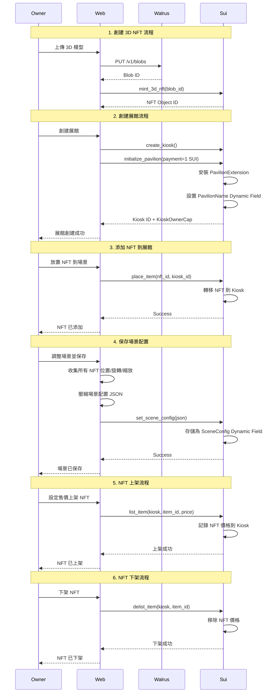
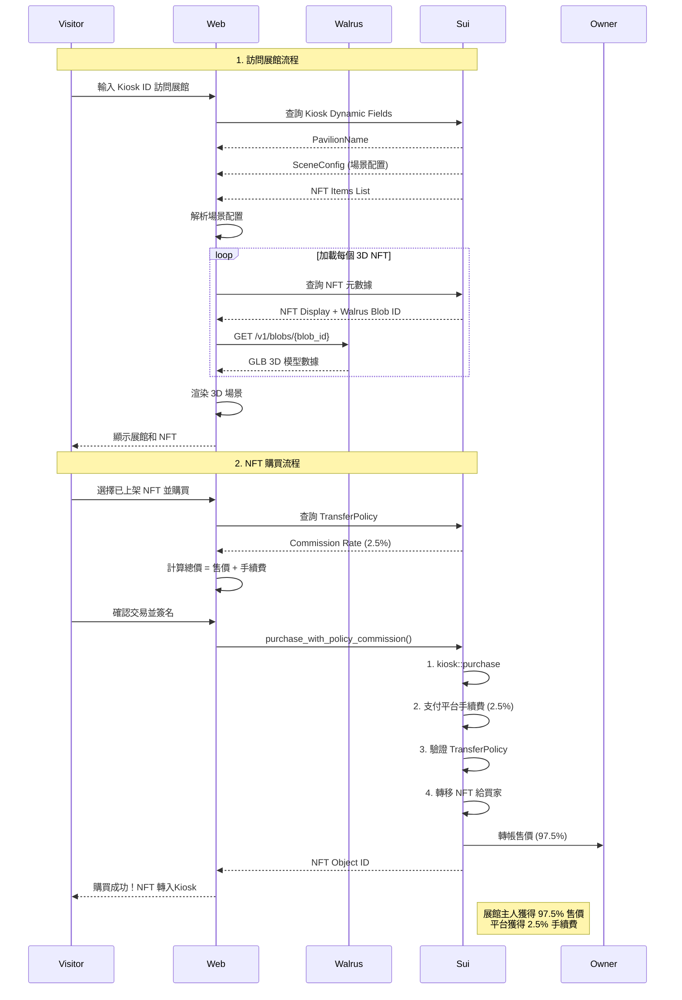

## project
- 项目名称: **Pavilion**

- 描述: 基於 Sui Kiosk 的 3D 藝廊拓展應用，提供用戶可以自行定義並擺放 NFT 收藏品的 3D 空間。以用戶 Kiosk 為中心的方式去創建並保存場景配置，並且可以在 Kiosk 中上下架、買賣 NFT；賦予 NFT 一個新的可能性。

- Sui钱包地址: **0x454ccc8e040708da1fcd163ad625fab06d998e1ff37490acaf22dc4c6b57c5fa**

## 参与赛道
- [x] Sui官方赛道
- [x] Bucket赛道
- [] Scallop赛道
- [] Navi赛道

## Member
- [Harper@231 Labs](https://github.com/do0x0ob)
- 自我介绍&技术栈: 建築設計背景、web2 測試工程師、Sui 鏈應用開發

## 参赛信息
- [项目代码1](https://github.com/231-Labs/pavilion) 
- [PPT]()
- [在线地址(Walrus Site)](https://pavilion.wal.app/)
- [在线地址(Vercel)](https://pavilion-231.vercel.app/)
- [一頁說明PDF](https://github.com/231-Labs/pavilion/blob/bc8eac6e22cd5c56167f48ca8befe8d904696fac/Pavilion%20-%20%E5%B0%88%E6%A1%88%E7%B0%A1%E4%BB%8B.pdf)

## 其他附加说明
合約地址 Testnet
V1: 0xb36eecdd6193f0770c9af6e9d9476b0f3b45f2ba77f163b7746054146f647841 --有鏈上調用交易紀錄
V3: 0x101d6c44aa8b36fcf769d9d07c7d4bc5b3d80bfda7fd13bcae5a3b984ef6c509 --當前最新版本

### 時序圖

**Pavilion Owner**

**Visitor**

**Staker&Admin(開發中)**

```mermaid
sequenceDiagram
  participant User as Owner/Visitor
  participant Admin as Platform Admin
  participant Frontend as Web
  participant Sui as Sui
  participant Clock as (Sui)<br>Clock Object

  Note over Admin, Sui: 0. 創建質押池（管理員操作）
  Admin ->> Frontend: 創建新的質押池
  Frontend ->> Sui: create_pool<SUI>(AdminCap)
  Sui ->> Sui: 初始化 StakingPool<SUI>
  Sui ->> Sui: 設置預設參數<br/>鎖定期: 7天<br/>APY: 5%<br/>提款費: 0.05%<br/>獎勵費: 0.1%
  Sui -->> Frontend: PoolAdminCap
  Frontend -->> Admin: 質押池創建成功

  Note over User, Clock: 1. 質押資產流程
  User ->> Frontend: 質押 SUI 支持展館
  Frontend ->> Frontend: 驗證最小質押額 (0.1 SUI)
  Frontend ->> Sui: stake(pool, payment, clock)
  Sui ->> Clock: 獲取當前時間戳
  Clock -->> Sui: timestamp_ms
  Sui ->> Sui: 將資產加入 StakingPool.balance
  Sui ->> Sui: pool.total_staked += amount
  Sui ->> Sui: 計算解鎖時間<br/>unlock_time = now + 7 days
  Sui ->> Sui: 創建 Patronage 證明
  Sui -->> Frontend: Patronage Object
  Frontend -->> User: 質押成功！

  Note right of Sui: Patronage 包含:<br/>- 質押金額<br/>- 質押時間<br/>- 解鎖時間<br/>- 累計獎勵
  
  Note over User, Clock: 2. 查詢待領取獎勵
  User ->> Frontend: 查看質押獎勵
  Frontend ->> Sui: calculate_pending_rewards(pool, patronage, clock)
  Sui ->> Clock: 獲取當前時間戳
  Clock -->> Sui: current_time
  Sui ->> Sui: 計算時間差<br/>elapsed = current_time - last_reward_time
  Sui ->> Sui: 計算獎勵<br/>reward = (amount × 5% × elapsed) / 1 year
  Sui -->> Frontend: 待領取獎勵金額
  Frontend -->> User: 顯示可領取獎勵

  Note over User, Clock: 3. 領取質押獎勵
  User ->> Frontend: 領取獎勵
  Frontend ->> Sui: claim_rewards(pool, patronage, clock)
  Sui ->> Sui: 計算總獎勵金額
  Sui ->> Sui: 扣除平台費用<br/>platform_fee = reward × 0.1%<br/>user_reward = reward × 99.9%
  Sui ->> Sui: pool.balance -= total_reward
  Sui ->> Sui: pool.platform_fee_balance += platform_fee
  Sui ->> Sui: 重置獎勵追蹤<br/>patronage.accumulated_rewards = 0<br/>patronage.last_reward_time = now
  Sui -->> Frontend: Coin<SUI> (user_reward)
  Frontend -->> User: 獎勵領取成功！

  Note right of Sui: 用戶獲得 99.9% 獎勵<br/>平台獲得 0.1% 費用
  
  Note over User, Clock: 4. 檢查解鎖狀態
  User ->> Frontend: 查看是否可以解除質押
  Frontend ->> Sui: is_unlocked(patronage, clock)
  Sui ->> Clock: 獲取當前時間戳
  Clock -->> Sui: current_time
  Sui ->> Sui: 檢查: current_time >= unlock_time
  Sui -->> Frontend: true / false
  Frontend -->> User: 顯示鎖定狀態

  Note over User, Clock: 5. 解除質押流程
  User ->> Frontend: 解除質押 (鎖定期結束後)
  Frontend ->> Sui: unstake(pool, patronage, clock)
  Sui ->> Sui: 驗證: current_time >= unlock_time
  Sui ->> Sui: 計算提款費用<br/>fee = amount × 0.05%<br/>withdrawal = amount × 99.95%
  Sui ->> Sui: pool.balance -= amount
  Sui ->> Sui: pool.platform_fee_balance += fee
  Sui ->> Sui: pool.total_withdrawn += amount
  Sui ->> Sui: pool.patronage_count -= 1
  Sui ->> Sui: 銷毀 Patronage 證明
  Sui -->> Frontend: Coin<SUI> (withdrawal)
  Frontend -->> User: 解除質押成功！

  Note right of Sui: 用戶獲得 99.95% 本金<br/>平台獲得 0.05% 費用
  
  Note over Admin, Sui: 6. 平台收取累積費用（管理員操作）
  Admin ->> Frontend: 收取平台費用
  Frontend ->> Sui: collect_platform_fees(pool, admin_cap, recipient, clock)
  Sui ->> Sui: 驗證管理員權限
  Sui ->> Sui: 獲取累積費用金額
  Sui ->> Sui: pool.platform_fee_balance -> Coin<SUI>
  Sui -->> Frontend: Coin<SUI>
  Frontend ->> Admin: 費用已轉入指定地址
  
  Note over Admin, Sui: 7. 調整質押池參數（管理員操作）
  Admin ->> Frontend: 更新質押池配置
  Frontend ->> Sui: update_lock_duration() / update_withdrawal_fee() / update_reward_rate()
  Sui ->> Sui: 驗證管理員權限
  Sui ->> Sui: 更新池參數
  Sui -->> Frontend: 更新成功
  Frontend -->> Admin: 參數已更新
```

